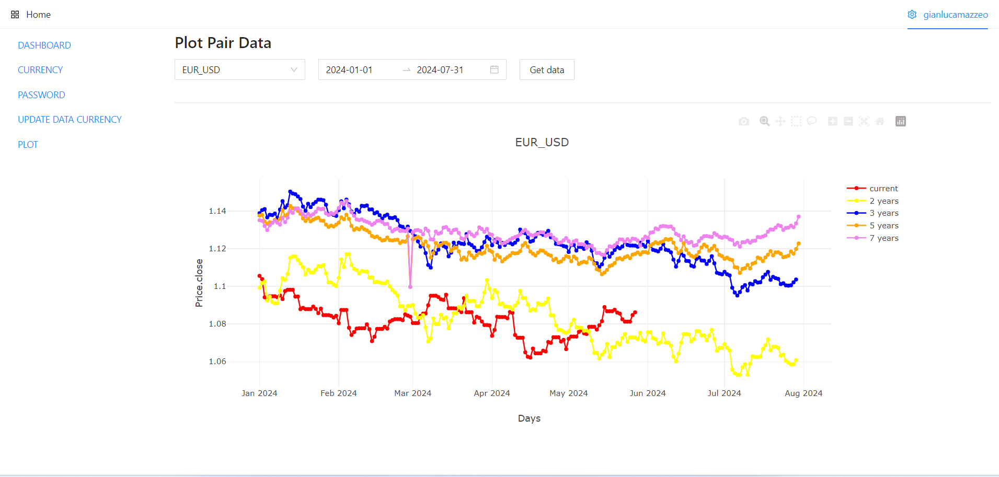

# SeasonFX

SeasonFX è un'applicazione che predice i movimenti futuri dei prezzi delle principali valute nel mercato forex basandosi sulla stagionalità e su medie matematiche.



## Descrizione del Progetto

SeasonFX analizza dati storici dei prezzi delle valute e utilizza medie matematiche per identificare pattern stagionali e prevedere i movimenti futuri dei prezzi. L'applicazione è suddivisa in un frontend sviluppato con React e un backend in Node.js, con MongoDB come database.

## Funzionalità

- Predizione dei movimenti futuri dei prezzi delle valute basata su medie matematiche
- Visualizzazione dei dati storici e dei pattern stagionali
- Interfaccia utente intuitiva sviluppata con React
- API backend per la gestione dei dati e delle predizioni

## Requisiti

- Node.js
- MongoDB
- React

## Installazione

1. **Clona il repository:**
    ```bash
    git clone https://github.com/gianlucamazzeo/seasonfx.git
    cd seasonfx
    ```

2. **Installa le dipendenze per il backend:**
    ```bash
    cd backend
    npm install
    ```

3. **Installa le dipendenze per il frontend:**
    ```bash
    cd ../frontend
    npm install
    ```

4. **Configura MongoDB:**
    - Crea un account su [MongoDB Atlas](https://www.mongodb.com/cloud/atlas) e configura un nuovo cluster.
    - Ottieni l'URI di connessione e aggiungilo al file di configurazione del backend (`backend/.env`).

5. **Esegui l'applicazione:**

    - Avvia il backend:
        ```bash
        cd backend
        npm start
        ```

    - Avvia il frontend:
        ```bash
        cd ../frontend
        npm start
        ```

## Utilizzo

1. Accedi all'interfaccia utente tramite il browser all'indirizzo `http://localhost:3000`.
2. Utilizza le funzionalità dell'app per visualizzare le predizioni dei prezzi e i dati storici.

## Struttura del Progetto

- **frontend/**: Contiene il codice sorgente del frontend sviluppato in React.
- **backend/**: Contiene il codice sorgente del backend sviluppato in Node.js.
- **models/**: Definisce i modelli di dati utilizzati da MongoDB.
- **routes/**: Definisce le API endpoints per la comunicazione frontend-backend.

## Contributi

Siamo aperti ai contributi da parte della community. Se desideri contribuire, segui questi passaggi:

1. Fork il repository.
2. Crea un branch per le tue modifiche (`git checkout -b feature/nome-feature`).
3. Effettua il commit delle tue modifiche (`git commit -m 'Aggiunta nuova feature'`).
4. Effettua il push delle modifiche (`git push origin feature/nome-feature`).
5. Apri una Pull Request.

## Licenza

Questo progetto è distribuito sotto licenza MIT. Vedi il file [LICENSE](LICENSE) per ulteriori dettagli.

## Contatti

Per ulteriori informazioni, puoi contattarmi tramite [email](mailto:tuoindirizzoemail@example.com).


